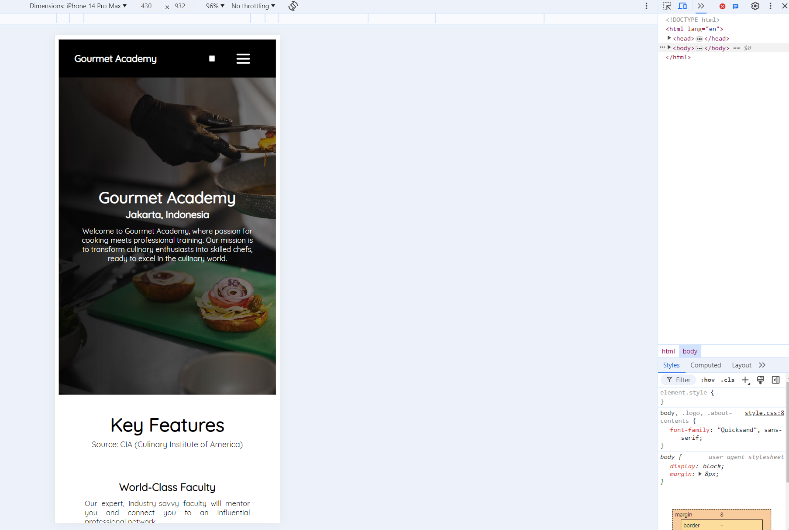

# Gourmet Academy Website

This website showcases the Gourmet Academy, a culinary school in Jakarta, Indonesia. It features information about the school, its programs, key features, top instructors, and contact details. 
You can visit the site here: hellopikunikku.site

## Structure

- **HTML:** The main structure of the website.
- **CSS:** The styling of the website.

## Sections

- **Header:** Contains the logo and navigation menu.
- **About:** Introduction to Gourmet Academy.
- **Key Features:** Highlights the unique selling points of the school.
- **Gallery:** Displays images of school activities.
- **Programs Offered:** Information about the different programs available.
- **Top Instructors:** Details about the school's top instructors.
- **Footer:** Contact information and subscription form.

## Development Process

1. Initially, a simple HTML structure was created for each section, without any styling. 

    

2. Each section was styled to ensure it aligned with the design requirements.
3. Media queries were added to ensure the website is responsive down to mobile sizes. 

    

4. The project was deployed to GitHub and Netlify for easy access and version control. 

     

    

5. The domain purchased last week was connected to the deployed site.

    

## Features

1. **Responsive Design** 
   The website is fully responsive, ensuring a seamless experience on all devices, including desktops, tablets, and mobile phones.

2. **Custom Font Integration** 
   Uses the Quicksand font for a clean and modern look that's easy to read.

3. **Interactive Navigation** 
   The menu changes to a dropdown row style when the hamburger icon is clicked, making it easy to use.

4. **Smooth Animations** 
   Includes smooth transitions for menu changes, making the experience better.

5. **CSS Variables** 
   Uses CSS variables to easily change and manage styles across the website.

## Animations

1. **Menu Transition Animation** 
   When the hamburger menu is clicked, the items slide into view smoothly.

2. **Hover Effects** 
   Buttons and links have subtle effects when hovered over, making them interactive.

## References, Design Choices, Consideration

- **Layout reference:** https://im3.id/portal/id/indexpersonal 
- **Content reference:** http://budoacademy.rf.gd/?i=3

    

- **Additional content references:** https://www.ciachef.edu/ and other similar academy websites.

    

